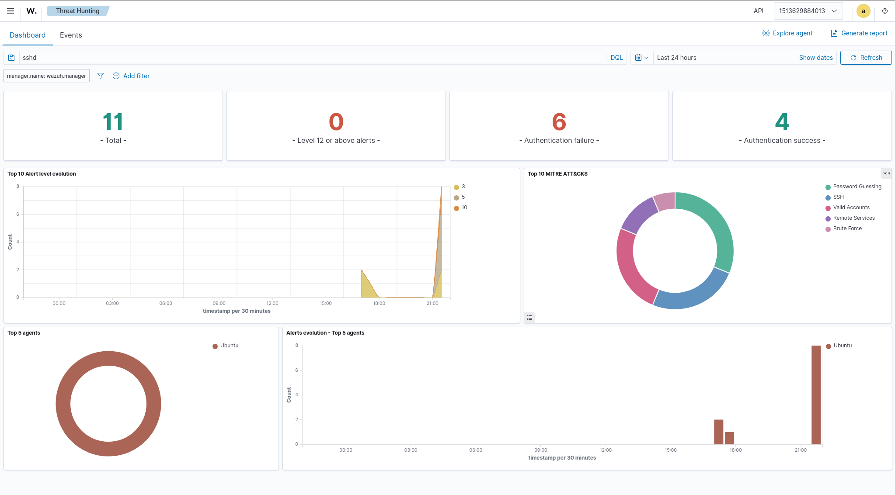
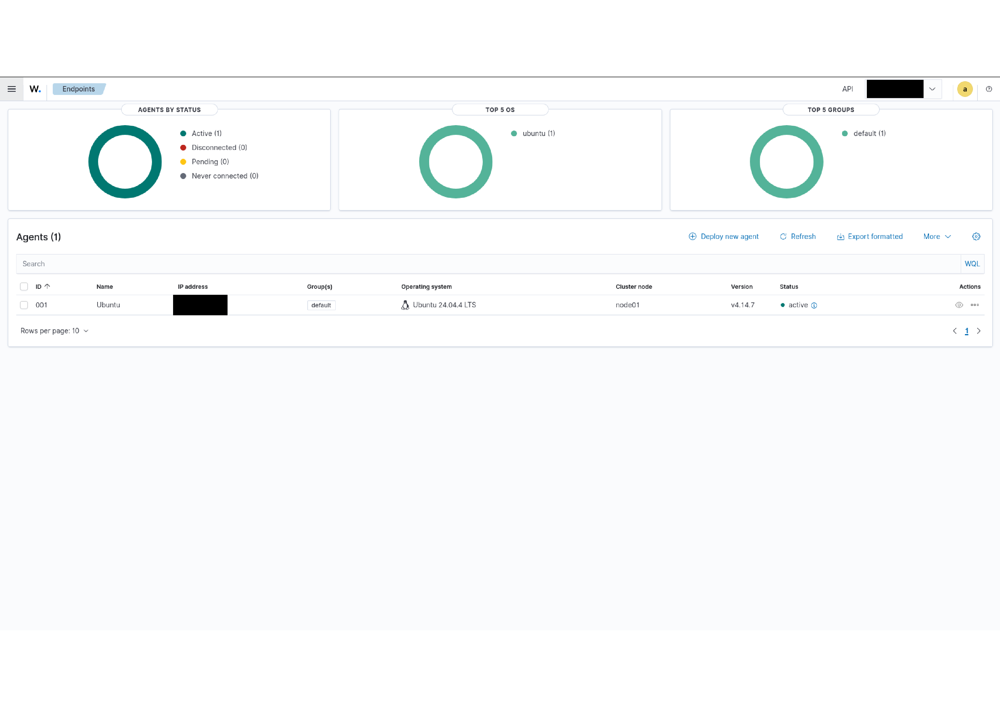
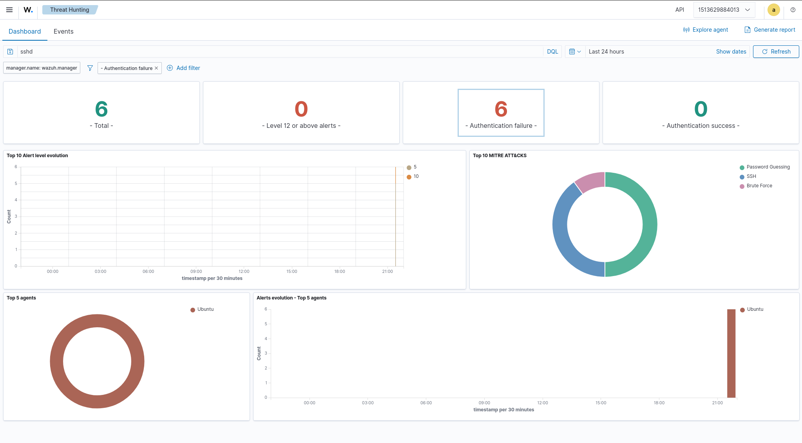
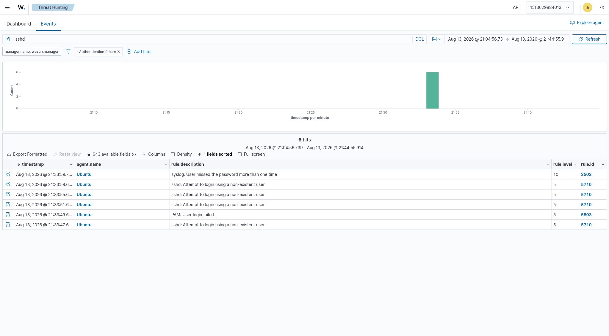
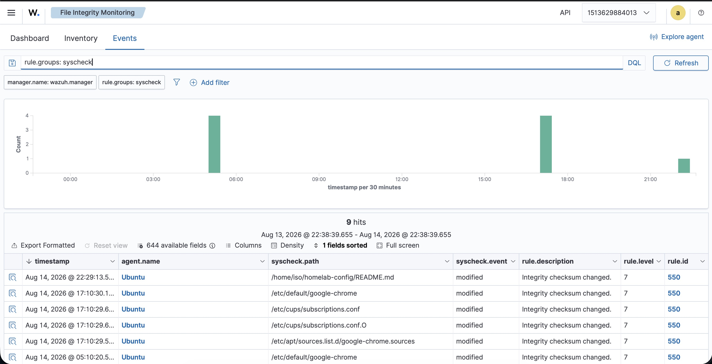
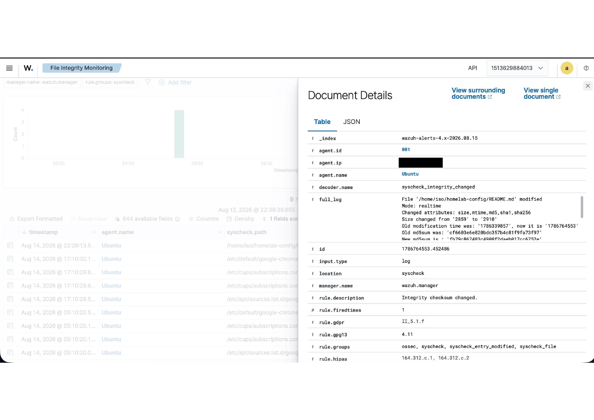
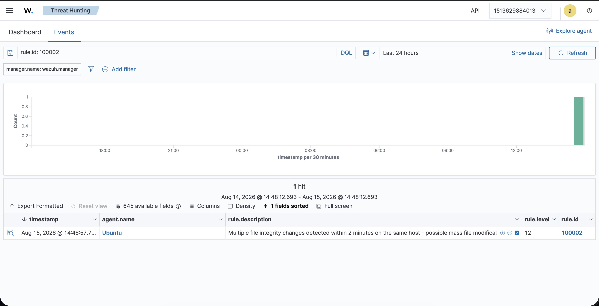
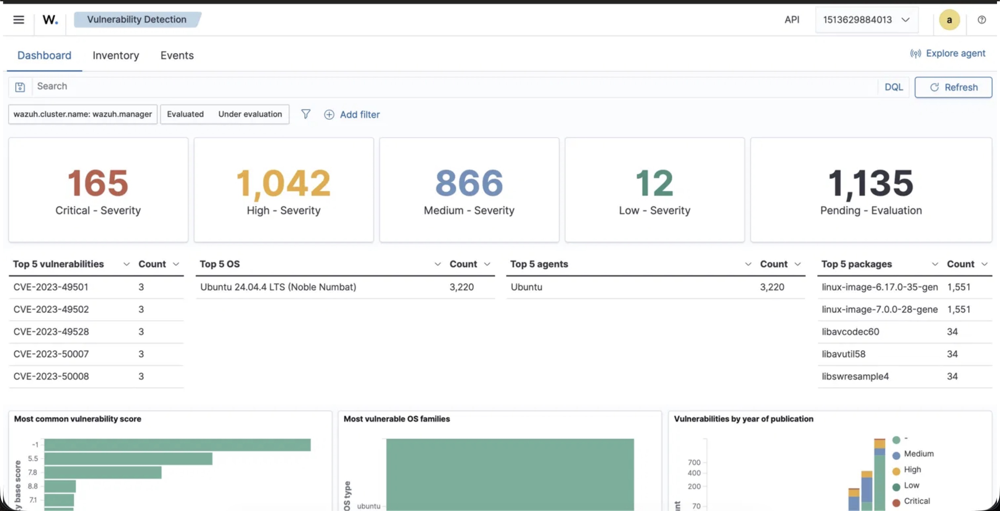
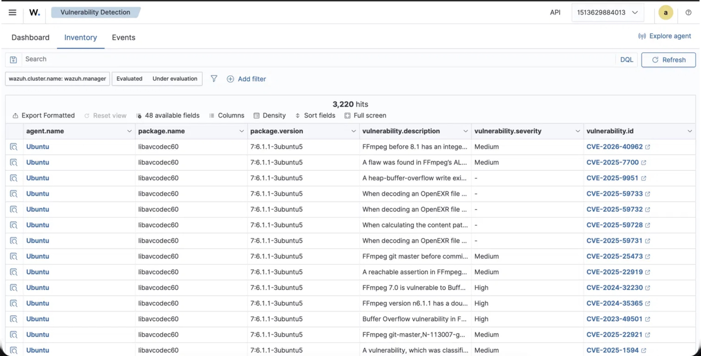
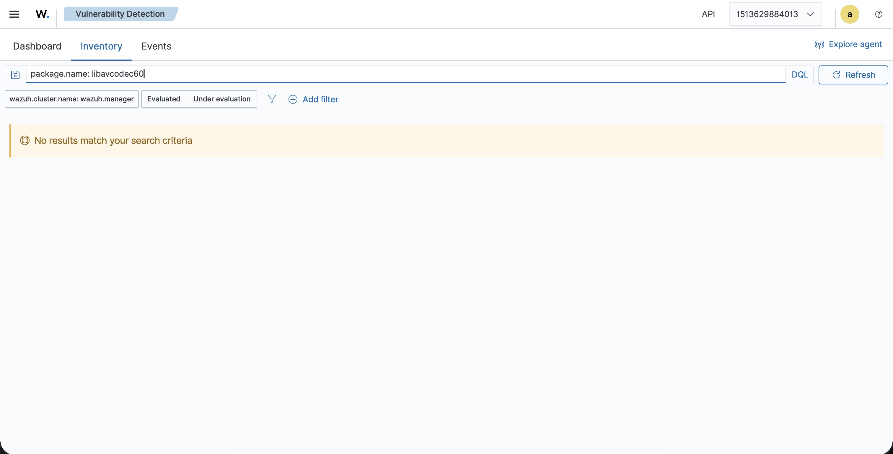

# Wazuh SIEM Homelab

A self-deployed Wazuh SIEM/XDR stack, built as a hands-on detection engineering project to develop and demonstrate practical security engineering skills — deploying a real SIEM, monitoring live infrastructure, and validating detections against actual attack simulations.

## Architecture

- **Wazuh Manager, Indexer, and Dashboard** deployed via Docker Compose (official single-node deployment) on a dedicated Ubuntu Server 24.04 LTS VM, provisioned on Proxmox
- **Agent** installed on a live homelab server running 35+ Docker containers (media, productivity, monitoring, and security services), providing real, active telemetry rather than a sterile test environment
- Manager and agent communicate over the standard Wazuh ports (1514/1515)



## Deployment

1. Provisioned a dedicated VM (4 vCPU, 16GB RAM, 80GB disk) on Proxmox
2. Installed Docker and configured `vm.max_map_count` for the Indexer (OpenSearch) per Wazuh's requirements
3. Deployed the official `wazuh-docker` single-node stack (v4.14.7) via Docker Compose
4. Generated the required indexer SSL certificates and brought up Manager, Indexer, and Dashboard
5. Deployed a Wazuh agent to a live homelab server and confirmed active connectivity from the dashboard

### Issue encountered: Dashboard index pattern timeout on first boot

On first launch, the Dashboard reported timeout errors ("[Alerts index pattern] timeout of 20000ms exceeded") while attempting to initialize its index patterns. Root cause was a startup race condition — the Indexer (OpenSearch) takes longer to fully initialize its internal indices than the Dashboard's default timeout allows for. Resolved by allowing the Indexer additional time to complete startup, then retrying the index pattern checks from the Dashboard UI.



## Detection: SSH Brute-Force Simulation

To validate the deployment was generating real, correctly-classified detections (not just passively running), I simulated a credential-guessing attack against the monitored agent's SSH service.

**Initial attempt and correction:** My first test used a valid username with an intentionally wrong password, expecting an authentication failure. Instead, Wazuh logged an *authentication success*. Investigation showed SSH key-based authentication was silently succeeding ahead of the password attempt, since the client had a valid key on file for that account. Corrected the test by using a nonexistent username, which forced SSH to reject the connection at the authentication layer rather than falling back to key auth.

**Result:** Wazuh correctly detected and escalated the attack pattern:

| Rule ID | Level | Description |
|---|---|---|
| 5710 | 5 | sshd: Attempt to login using a non-existent user |
| 5503 | 5 | PAM: User login failed |
| 2502 | 10 | syslog: User missed the password more than one time (correlation rule) |

The individual failed attempts were logged at level 5, and Wazuh's correlation engine escalated to a level 10 alert after detecting the repeated-failure pattern — correctly classified under the MITRE ATT&CK techniques **Password Guessing** and **Brute Force**.





## Detection: File Integrity Monitoring (FIM)

To extend detection coverage beyond authentication events, I configured File Integrity Monitoring on high-value paths: `/etc/passwd`, `/etc/shadow`, `/etc/ssh/sshd_config`, and this project's own infrastructure repository (`homelab-config`).

**Configuration:** By default, Wazuh's agent monitors broad system directories (`/etc`, `/usr/bin`, `/usr/sbin`, `/bin`, `/sbin`, `/boot`) on a 12-hour scan interval, reporting only that a change occurred. I added a second, more targeted layer on top of this: real-time monitoring (`realtime="yes"`) with full diff reporting (`report_changes="yes"`) scoped specifically to the paths above, so that changes to these specific files are detected immediately and with full detail, rather than waiting up to 12 hours for a generic "something changed" alert.

**Test:** Appended a comment line to `homelab-config/README.md` and confirmed detection end-to-end.



Wazuh detected the change within seconds (real-time mode) and generated rule 550 ("Integrity checksum changed"). Drilling into the event shows the full diff Wazuh captured:

```
File '/home/iso/homelab-config/README.md' modified
Mode: realtime
Changed attributes: size,mtime,md5,sha1,sha256
Size changed from '2859' to '2910'
Old md5sum was: 'cf6603e6e820bdc357b4c81f9fa73f97'
New md5sum is: 'fb79c867483c4908f2daeb017cc6752e'
```



Wazuh also auto-mapped the event to relevant compliance controls (GDPR II_5.1.f, HIPAA 164.312.c.1/c.2), which is a reminder that FIM isn't just a detection mechanism — it's a control that shows up by name in most regulatory frameworks, which is part of why it's a standard requirement in enterprise security rather than an optional nice-to-have.

## Detection: Custom Correlation Rule (Mass File Modification)

To go beyond using Wazuh's default ruleset, I wrote a custom correlation rule that escalates when multiple file integrity events occur in a short window — the kind of pattern ransomware or a compromised account rewriting many files quickly would produce.

**Rule logic:** if 5+ FIM events (rule 550) fire within 120 seconds, escalate to a level 12 alert mapped to MITRE ATT&CK T1486 (Data Encrypted for Impact).

### Debugging the rule: from "should work" to actually working

The rule initially did not fire, despite generating clean test data well within the configured window. Rather than guess, I isolated the cause step by step:

1. **Validated the rule syntax directly against the Manager's engine** using `wazuh-logtest`, feeding the exact log line that generates rule 550 multiple times in a controlled session. The rule fired correctly here, confirming the XML and correlation logic itself were valid.
2. **Ruled out common false leads** one at a time: `same_field`/`same_source_ip` conditions on unpopulated fields, `if_matched_group` vs `if_matched_sid` syntax differences, config reload timing, and incomplete test runs (an early test loop was silently interrupted mid-run by SSH's password-retry behavior, producing fewer events than intended).
3. **Compared against Wazuh's own built-in frequency rules** (e.g., rule 5712) to confirm the syntax pattern matched a known-working template.
4. **Found the actual root cause**: `analysisd.rule_matching_threads` was set to `0` (auto), which scales rule matching across multiple parallel threads based on CPU count. Frequency/timeframe correlation state is tracked per-thread, not globally — so events landing on different threads never accumulated toward the same counter, even though they were clustered within the configured window in wall-clock time.
5. **Fix**: set `analysisd.rule_matching_threads=1` in `local_internal_options.conf`, forcing single-threaded rule matching so correlation state stays consistent. Retested live and confirmed the rule fired correctly.



This was a more valuable exercise than a rule that worked on the first try — multi-threaded correlation fragmentation is a real, documented category of SIEM tuning issue, and working through it required understanding Wazuh's internals (decoding → rule matching → frequency tracking) rather than just its UI.

## Lessons Learned

- SIEM detection testing requires understanding the full authentication chain (key vs. password auth), not just triggering a "failed login" at face value
- Correlation rules (like 2502) provide meaningfully higher-fidelity signal than individual auth-failure events, which is why tuning and understanding rule escalation logic matters as much as deploying the tool itself
- First-boot timing issues between distributed components (Indexer vs. Dashboard) are a normal part of deploying multi-container security tooling, not a misconfiguration

## Vulnerability Detection & Remediation

Wazuh's vulnerability detection module scans installed packages on the agent against known CVE databases. On first scan, it identified 2,085 vulnerabilities across the monitored host, including 165 rated Critical and 1,042 rated High.



A large share of the highest-severity findings traced back to a single outdated package: libavcodec60 (part of the FFmpeg library used by Jellyfin for video transcoding), running version 7:6.1.1-3ubuntu5 with multiple known CVEs spanning 2023-2025, including CVE-2023-49501 (High, buffer overflow).



### Remediation: from "no fix available" to a real patch

Checking for an update the standard way showed no fix available: installed and candidate versions were identical. Rather than treating this as a dead end, I checked Ubuntu's own security notices directly and found that a fix does exist (USN-6803-1), but it's gated behind Ubuntu Pro's ESM channel rather than the standard free repositories. Ubuntu Pro is free for personal use on up to 5 machines, so I attached this host to a free Ubuntu Pro subscription and enabled esm-apps to access the patch.

Unplanned detour: enabling ESM and running apt update initially failed with "No space left on device" — the host's root filesystem was completely full, which was also silently blocking normal apt operations entirely. Investigated disk usage and found several gigabytes of already-imported media duplicated in a downloads staging folder; clearing verified-duplicate files freed enough space to proceed.

With space freed and ESM enabled, the patched version became available and installable.

### Verification

After restarting the Wazuh agent to force a fresh package inventory sync, a follow-up scan confirmed the finding cleared:



## Next Steps

- [x] Configure File Integrity Monitoring (FIM) on key infrastructure paths
- [x] Write a custom detection rule
- [x] Enable vulnerability detection module
- [ ] Add a second agent
